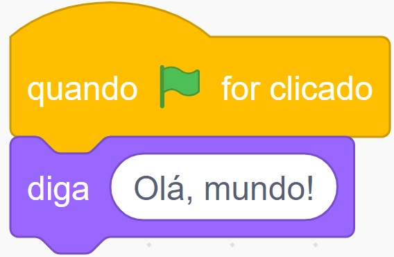
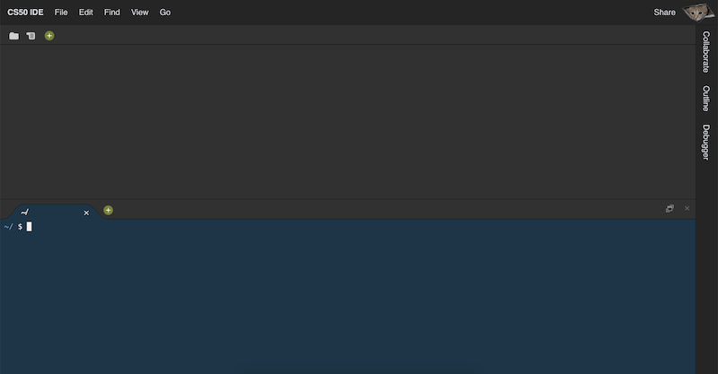
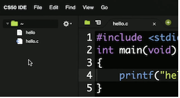

# Aula 1

- [C](./notes.md#c)
- [IDE CS50](./notes.md#ide-cs50)
- [Compilando](./notes.md#compilando)
- [Funções e argumentos](./notes.md#funções-e-argumentos)
  - [main, arquivos de cabeçalho](./notes.md#função-main-e-arquivos-de-cabeçalho)
- [Ferramentas](./notes.md#ferramentas)
  - style50
  - check50
  - submit50
- [Comandos](./notes.md#comandos-linux)
- [Tipos, códigos de formato](./notes.md#tipos-de-dados-e-códigos-de-formatação)
- [Operadores, limitações, truncamento](./notes.md#operadores-limites-e-truncamento)
- [Variáveis, açúcar sintático](./notes.md#variáveis-açúcar-sintático)
- [Condições](./notes.md#condições)
  - [Expressões booleanas, laços](./notes.md#expressões-booleanas-laços)
- [Abstração](./notes.md#abstração)
  - [Mario](./notes.md#mario)
- [Memória, imprecisão e estouro](./notes.md#memória-imprecisão-e-estouro)

## C
- Hoje vamos aprender uma nova linguagem, **C**: uma linguagem de programação que tem todos os recursos do Scratch e muito mais, mas talvez um pouco menos amigável, pois é puramente em texto:
```c
#include <stdio.h>

int main(void)
{
    printf("ola, mundo");
}
```
- Embora em princípio, pegando emprestada uma frase do MIT, tentar absorver todos esses novos conceitos pode parecer como beber água de uma mangueira de incêndio, tenha certeza de que, no final do semestre, estaremos fortalecidos e experientes em aprender e aplicar esses conceitos .
- Podemos comparar muitos dos recursos de programação em C aos blocos que já vimos e usamos no Scratch. Os detalhes da sintaxe são muito menos importantes do que as **ideias**, às quais já fomos apresentados.
- Em nosso exemplo, embora as palavras sejam novas, as ideias são exatamente as mesmas que os blocos "quando a bandeira verde for clicada" e "diga (olá, mundo)" no Scratch:



- Ao escrever o código, podemos considerar as seguintes qualidades:
  - **Correção**, ou se nosso código funciona corretamente, conforme pretendido.
  - **Projeto** (_design_), ou uma medida subjetiva de quão bem escrito nosso código é, com base em quão eficiente é e quão elegante ou logicamente legível é, **sem repetição** desnecessária.
  - **Estilo**, ou o quão esteticamente formatado nosso código é, em termos de indentação consistente e outra colocação de símbolos. As diferenças de estilo não afetam a exatidão ou o significado do nosso código, mas afetam o quão legível é visualmente.

  ## IDE CS50
-   Para começar a escrever nosso código rapidamente, usaremos uma ferramenta para o curso, a IDE CS50, um ambiente de desenvolvimento integrado que inclui programas e recursos para escrever código. O IDE CS50 é construído sobre um IDE baseado em nuvem popular usado por diversos programadores, mas com recursos educacionais adicionais e personalização.
- Abriremos o IDE e, após fazer o login, veremos uma tela como esta:



  - O painel superior, em branco, conterá arquivos de texto nos quais podemos escrever nosso código.
  - O painel inferior, uma janela de terminal, nos permitirá digitar vários comandos e executá-los, incluindo programas de nosso código acima.
- Nosso IDE é executado na nuvem e vem com um conjunto padrão de ferramentas, mas saiba que também existem muitos IDEs baseados em desktop, oferecendo mais personalização e controle para diferentes fins de programação, **ao custo de maior tempo e esforço de configuração**.
- No IDE, iremos para File > New File e, em seguida, File > Save para salvar nosso arquivo como **ola.c**, indicando que nosso arquivo será um código escrito em **C**. Veremos que o nome de nossa guia tem de fato mudou para **ola.c**, e agora vamos colar nosso código acima:
```c
#include <stdio.h>

int main(void)
{
    printf("ola, mundo");
}
```
- Para executar nosso programa, usaremos uma interface de linha de comando (do inglês, _Command Line Interface, CLI_), um prompt no qual precisamos inserir comandos de texto. Isso contrasta com a **interface gráfica do usuário** (do inglês, _Graphical User Intarface, GUI_), como o Scratch, onde temos imagens, ícones e botões além do texto.

## Compilando
- No terminal no painel inferior de nosso IDE, vamos **compilar** nosso código antes de executá-lo. Os computadores só entendem binário, que também é usado para representar instruções como imprimir algo na tela. Nosso **código-fonte** foi escrito em caracteres que podemos ler, mas precisa ser compilado: convertido em **código de máquina**, padrões de zeros e uns que nosso computador possa entender diretamente.
- Um programa chamado **compilador** pegará o código-fonte como entrada e produzirá código de máquina como saída. No IDE CS50, já temos acesso a um compilador, por meio de um comando chamado **make**. Em nosso terminal, digitaremos `make ola`, que encontrará automaticamente nosso arquivo `ola.c` com nosso código-fonte e o compilará em um programa chamado `hello`. Haverá alguma saída, mas nenhuma mensagem de erro em amarelo ou vermelho, então nosso programa foi compilado com sucesso.
- Para executar nosso programa, digitaremos outro comando, `./ola`, que procura na pasta atual, `.`, Por um programa chamado `ola` e o executa.
- O `$` no terminal é um indicador de onde está o prompt ou onde podemos digitar mais comandos.

## Funções e argumentos
- Usaremos as mesmas ideias que exploramos no Scratch.
- **Funções** são pequenas ações ou verbos que podemos usar em nosso programa para fazer algo, e as entradas para funções são chamadas de argumentos.
  - Por exemplo, no bloco "diga" no Scratch podemos considerar algo como "olá, mundo" como um argumento. Em C, a função de imprimir algo na tela é chamada de `printf` (com **f** significando texto "**formatado**", que veremos em breve). E em C, passamos os argumentos entre parênteses, como em `printf("hello, world");`. As aspas duplas indicam que queremos imprimir as letras `hello, world` literalmente, e o ponto-e-vírgula no final indica o final de nossa linha de código.
- As funções também podem ter dois tipos de saídas:
  - **efeitos colaterais**, como algo impresso na tela,e
  - **valores de retorno**, um valor que é passado de volta ao nosso programa que podemos usar ou armazenar para mais tarde.
    - O bloco pergunte no Scratch, por exemplo, criou um bloco resposta.

- Para obter a mesma funcionalidade do bloco "pergunte", usaremos uma **biblioteca** ou um conjunto de código já escrito. A Biblioteca **CS50** incluirá algumas funções básicas e simples que podemos usar imediatamente. Por exemplo, `get_string` pedirá ao usuário uma **string**, ou alguma sequência de texto, e a retornará ao nosso programa. `get_string` recebe alguma entrada como prompt para o usuário, como Qual é o seu nome ?, e teremos que salvá-la em uma variável com:
```c
string answer = get_string ("Qual é o seu nome?");
```
  - Em C, um único sinal de igualdade, `=`, indica **atribuição** ou **definição do valor** à direita para a variável à esquerda. E C chamará a função `get_string` para obter sua saída primeiro.
  - Também precisamos indicar que nossa variável chamada `resposta` tem um tipo de `string`, então nosso programa sabe interpretar os zeros e uns como texto.
  - Finalmente, precisamos nos lembrar de adicionar um ponto-e-vírgula para encerrar nossa linha de código.
- No Scratch, também usamos o bloco “resposta” dentro de nossos blocos “junte” e “diga”. Em C, faremos isso:
```c
printf ("olá, %s", resposta);
```
  - O `%s` é chamado de **código de formato**, o que significa apenas que queremos que a função `printf` substitua uma variável onde está o **espaço reservado** `%s`. E a variável que queremos usar é `resposta`, que damos a `printf` como outro argumento, separado do primeiro por uma vírgula. (`printf ("ola, resposta")` iria literalmente imprimir `ola, resposta` sempre.)
- De volta ao IDE CS50, adicionaremos o que descobrimos:
```c
#include <cs50.h>
#include <stdio.h>

int main (void)
{
     string resposta = get_string ("Qual é o seu nome?");
     printf ("olá,% s", resposta);
}
```
  - Precisamos dizer ao compilador para incluir a Biblioteca CS50, com `#include <cs50.h>`, para que possamos usar a função `get_string`.
  - Também temos a oportunidade de usar um estilo melhor aqui, já que poderíamos nomear nossa variável de `resposta` com qualquer coisa, mas um nome mais descritivo nos ajudará a entender sua finalidade melhor do que um nome mais curto como `a` ou `x`.
- Depois de salvar o arquivo, precisaremos recompilar nosso programa com `make ola`, uma vez que alteramos apenas o código-fonte, mas não o código de máquina compilado. Outras linguagens ou IDEs podem não exigir que recompilemos manualmente nosso código após alterá-lo, mas aqui temos a oportunidade de mais controle e compreensão do que está acontecendo nos bastidores.
- Agora, `./ola` executará nosso programa e solicitará nosso nome conforme pretendido. Podemos notar que o próximo prompt é impresso imediatamente após a saída de nosso programa, como em `ola, Inacio ~/ $`. Podemos adicionar uma nova linha após a saída de nosso programa, de modo que o próximo prompt esteja em sua própria linha, com `\n`:
```c
printf ("olá, %s \n", resposta);
```

- `\n` é um exemplo de uma **sequência de escape** ou algum texto que representa algum outro texto.

# Função main e arquivos de cabeçalho
- O bloco “quando a bandeira verde for clicada” no Scratch inicia o que consideramos ser o programa principal. Em C, a primeira linha para o mesmo é `int main (void)`, sobre a qual aprenderemos mais nas próximas semanas, seguida por uma chave aberta `{`e uma chave fechada `}`, envolvendo tudo o que deveria estar em nosso programa.
```c
int main(void)
{

}
```

  - Aprenderemos mais sobre como podemos modificar essa linha nas próximas semanas, mas, por enquanto, simplesmente usaremos isso para iniciar nosso programa.
- **Arquivos de cabeçalho** que terminam com `.h` referem-se a algum outro conjunto de código, como uma biblioteca, que podemos usar em nosso programa. Nós os incluímos com linhas como `#include <stdio.h>`, por exemplo, para a biblioteca de **entrada/saída** padrão, que contém a função `printf`.

## Ferramentas
- Com toda a nova sintaxe, é fácil cometer erros ou esquecer algo. Temos algumas ferramentas escritas pela equipe para nos ajudar.
- Podemos nos esquecer de incluir uma linha de código e, quando tentamos compilar nosso programa, vemos muitas linhas de mensagens de erro que são difíceis de entender, pois o compilador pode ter sido projetado para um público mais técnico. **help50** é um comando que podemos executar para explicar problemas em nosso código de uma forma mais amigável. Podemos executá-lo adicionando `help50` à frente de um comando que estamos tentando, como `help50 make hello`, para obter conselhos que podem ser mais compreensíveis.
- Acontece que, em C, novas linhas e indentação geralmente não afetam a forma como nosso código é executado. Por exemplo, podemos alterar nossa função principal para uma linha, 
```c
int main (void) {printf ("hello, world");}
```
mas é muito mais difícil de ler, então consideramos que tem um estilo ruim. Podemos executar **style50**, como `style50 ola.c`, com o nome do arquivo de nosso **código-fonte**, para ver sugestões de novas linhas e indentação.
- Além disso, podemos adicionar **comentários**, ou seja, notas e observações em nosso código-fonte para nós mesmos ou outras pessoas que não afetam a forma como nosso código é executado. Por exemplo, podemos adicionar uma linha como `// Cumprimentar o usuário`, com duas barras `//` para indicar que a linha é um comentário e, em seguida, escrever o propósito do nosso código ou programa para nos ajudar a lembrar mais tarde.
- **check50** irá verificar a exatidão do nosso código com alguns testes automatizados. A equipe CS50 escreve testes especificamente para alguns dos programas que escreveremos no curso, e as instruções para usar o `check50` serão incluídas em **cada conjunto de problemas ou laboratório**, conforme necessário. Depois de executar `check50`, veremos alguma saída nos informando se nosso código passou nos testes relevantes.
- O IDE CS50 também nos dá o equivalente a nosso próprio computador na nuvem, em algum lugar da internet, com nossos próprios arquivos e pastas. Se clicarmos no ícone de pasta no canto superior esquerdo, veremos uma árvore de arquivos, uma GUI dos arquivos em nosso IDE:



  - Para abrir um arquivo, podemos apenas clicar duas vezes nele. `ola.c` é o código-fonte que acabamos de escrever, e `ola` em si terá muitos pontos vermelhos, cada um dos quais são caracteres **não imprimíveis**, pois representam instruções binárias para nossos computadores.

## Comandos Linux
- Como o IDE CS50 é um computador virtual na nuvem, também podemos executar comandos disponíveis no Linux, um sistema operacional como o macOS ou Windows.
- No terminal, podemos digitar `ls`, abreviação de **list**, para ver uma lista de arquivos e pastas na pasta atual:
```bash
~/ $ ls
olá * olá.c
```
  - `ola` está em verde com um asterisco para indicar que podemos executá-lo como um programa.
- Também podemos **remover** arquivos com `rm`, com um comando como `rm ola`. Isso nos solicitará uma confirmação e podemos responder com `y` ou `n` para sim ou não.
- Com `mv`, ou **move**, podemos renomear arquivos. Como em `mv ola.c adeus.c`, renomeamos nosso arquivo `ola.c` com o nome `adeus.c`.
- Com `mkdir`, ou **criar diretório**, podemos criar pastas ou diretórios. Se executarmos `mkdir aulas`, veremos uma pasta chamada `aulas` e podemos mover arquivos para diretórios com um comando como `mv ola.c aulas/`.
- Para mudar de diretório em nosso terminal, podemos usar `cd`, como em `cd aulas/`. Nosso prompt mudará de `~/` para `~/aulas/`, indicando que estamos no diretório de aulas dentro de `~`. `~` representa nosso diretório inicial ou a pasta padrão de nível superior de nossa conta.
- Também podemos usar `..` como uma abreviação para o **diretório pai**, ou pasta de conteúdo. Em `~ /aulas/`, podemos executar `mv ola.c ..`. para movê-lo de volta para `~`, uma vez que esta é a pasta pai de `aulas/`. `cd ..`, da mesma forma, mudará o diretório do nosso terminal para o pai atual. Um único ponto, `.`, Refere-se ao diretório atual, como em `./ola` indica o arquivo `ola` na pasta atual.
- Agora que nossa pasta `aula/` está vazia, podemos removê-la com `rmdir aula/` também.
- Para remover uma pasta não vazia e todo seu conteúdo, utilize o comando `rm -r pasta` ou `rm -rf pasta`. O primeiro irá perguntar se você deseja apagar cada arquivo ou pasta. O segundo vai remover tudo sem qualquer pergunta, portanto, **CUIDADO!**

## Tipos de dados e códigos de formatação
- Existem muitos **tipos de dados** que podemos usar para nossas **variáveis**, que indicam ao computador que tipo de dados eles representam:
  - **bool**, uma expressão booleana de `true` (verdadeiro) ou `false` (falso)
  - **char**, um único caractere ASCII como `a` ou `2`
  - **double**, um valor de ponto flutuante com mais dígitos do que um `float`
  - **float**, um valor de ponto flutuante ou número real com um valor decimal
  - **int**, inteiros até um certo tamanho ou número de bits
  - **long**, inteiros com mais bits, para que possam contar mais do que um int
  - **string**, uma cadeia de caracteres
- E a biblioteca CS50 tem funções correspondentes para obter entrada de vários tipos:
  - get_char
  - get_double
  - get_float
  - get_int
  - get_long
  - get_string
- Para `printf`, também, existem marcadores de posição diferentes para cada tipo:
  - %c para caracteres
  - %f para flutuadores, duplos
  - %i para ints
  - %li para longos
  - %s para strings

## Operadores, limites e truncamento
- Existem vários operadores matemáticos que podemos usar também:
  - **+** para adição
  - **-** para subtração
  - __*__ para multiplicação
  - **/** para divisão
  - **%** para o restante

- Vamos escrever um novo programa, `soma.c`:
```c
#include <cs50.h>
#include <stdio.h>

int main(void)
{
    int x = get_int("x: ");

    int y = get_int("y: ");

    printf("%i\n", x + y);
}
```
- Incluiremos arquivos de cabeçalho para bibliotecas que sabemos que queremos usar e, em seguida, chamaremos `get_int` para obter inteiros do usuário, armazenando-os em variáveis ​​chamadas `x` e `y`.
- Então, em `printf`, imprimiremos um espaço reservado para um inteiro, `%i`, seguido por uma nova linha, `\n`. Uma vez que queremos imprimir a soma de `x` e `y`, vamos passar `x + y` para `printf` para substituir na `string`.
- Vamos salvar, executar `make soma` no terminal e depois `./soma` para ver nosso programa funcionando. Se digitarmos algo que não seja um inteiro, veremos `get_int` nos pedindo um inteiro novamente. Se digitarmos um número realmente grande, como `4000000000`, `get_int` nos alertará novamente. Isso ocorre porque, como em muitos sistemas de computador, um `int` no IDE CS50 é de **32 bits**, que pode conter apenas cerca de quatro bilhões de valores diferentes. E uma vez que os inteiros podem ser positivos ou negativos, o maior valor positivo para um `int` só pode ser cerca de dois bilhões, com um valor negativo mais baixo de cerca de dois bilhões negativos, para um total de cerca de quatro bilhões de valores totais.
- Podemos mudar nosso código para usar o tipo `long`:
```c
#include <cs50.h>
#include <stdio.h>

int main(void)
{
    long x = get_long("x: ");

    long y = get_long("y: ");

    printf("%li\n", x + y);
}
```
  - Agora podemos digitar inteiros maiores e ver um resultado correto conforme o esperado.
- Sempre que recebermos um erro durante a compilação, é uma boa ideia rolar para cima para ver o primeiro erro e corrigi-lo primeiro, já que às vezes um erro no início do programa fará com que o resto do programa seja interpretado com erros também.
- Vejamos outro exemplo, truncamento.c:
```c
#include <cs50.h>
#include <stdio.h>

int main(void)
{
    // Solicita numeros ao usuario
    int x = get_int("x: ");
    int y = get_int("y: ");

    // Divide x por y
    float z = x / y;
    printf("%f\n", z);
}
```
  - Vamos armazenar o resultado de `x` dividido por `y` em `z`, um valor de ponto flutuante ou número real, e imprimi-lo como um ponto flutuante também.
  - Mas quando compilamos e executamos nosso programa, vemos `z` impresso como números inteiros como `0.000000` ou `1.000000`. Acontece que, em nosso código, `x / y` é dividido é uma divisão de números inteiros, portanto, o resultado fornecido pela operação de divisão também é um inteiro, esta é uma característica da linguagem C. O resultado é **truncado**, e o valor após a vírgula perdida. Mesmo que `z` seja um `float`, o valor que estamos armazenando nele já é um número inteiro.
  - Para corrigir isso, fazemos um **cast**, ou seja, **convertemos**, nossos inteiros em flutuantes antes de dividi-los:
```c
float z = (float) x / (float) y;
```
  - O resultado será um `float` como esperamos e, de fato, podemos fazer cast em apenas um dos valores `x` ou `y` e obter um `float` também.

## Variáveis, açúcar sintático
- No Scratch, tínhamos blocos como mude [contador] para (0)” que definem uma variável para algum valor. Em C, escreveríamos 
`int counter = 0;`
para o mesmo efeito.
- Podemos aumentar o valor de uma variável com `contador = contador + 1;`, onde olhamos primeiro para o lado direito, pegando o valor original de `contador`, adicionando 1 e, em seguida, armazenando-o no lado esquerdo (de volta ao `contador` neste caso)
- C também suporta açúcar sintático ou expressões abreviadas para a mesma funcionalidade. Nesse caso, poderíamos dizer de maneira equivalente `contador += 1`; para adicionar um ao `contador` antes de armazená-lo novamente. Também poderíamos escrever `contador++`; e podemos aprender isso (e outros exemplos) olhando a documentação ou outras referências online.

## Condições
- Podemos traduzir condições, ou blocos “if”, como em:
```c
if (x < y)
{
    printf("x eh menor que y\n");
}
```
  - Observe que em C, usamos `{` e `}` (bem como **indentação**) para indicar como as linhas de código devem ser aninhadas (organizadas).
- Podemos ter condições “if” e “else”:
```c
if (x < y)
{
    printf("x eh menor que y\n");
}
else
{
    printf("x nao eh menor que y\n");
}
```
- E mesmo “else if”:
```c
if (x < y)
{
    printf("x eh menor que y y\n");
}
else if (x > y)
{
    printf("x eh MAIOR que y y\n");
}
else if (x == y)
{
    printf("x eh igual y\n");
}
```´
  - Obs´erve que, para comparar dois valores em C, usamos `==`, dois sinais de igual.
  - E, logicamente, não precisamos do if (x == y) na condição final, já que esse é o único caso restante, então podemos apenas ter um “else”:
```c
if (x < y)
{
    printf("x eh menor que y y\n");
}
else if (x > y)
{
    printf("x eh MAIOR que y y\n");
}
else
{
    printf("x eh igual a y\n");
}
```

- Vamos dar uma olhada em outro exemplo, `condicao.c`:
```c
#include <cs50.h>
#include <stdio.h>

int main(void)
{
    // Solicita o valor de x ao usuario
    int x = get_int("x: ");

    // Solicita o valor de y ao usuario
    int y = get_int("y: ");

    // Compara x e y
    if (x < y)
    {
        printf("x eh menor que y y\n");
    }
    else if (x > y)
    {
        printf("x eh MAIOR que y y\n");
    }
    else
    {
        printf("x eh igual a y\n");
    }
}
```
  - Incluímos as condições que acabamos de ver, juntamente com duas chamadas, ou usos, de `get_int` para obter `x` e `y` do usuário.
  - Vamos compilar e executar nosso programa para ver se ele realmente funciona como pretendido.
- Em `concordo.c`, podemos pedir ao usuário para confirmar ou negar algo:
```c
#include <cs50.h>
#include <stdio.h>

int main(void)
{
    char c = get_char("Voce concorda? ");

    // Verifica a resposta do usuario
    if (c == 'Y' || c == 'y')
    {
        printf("Concorda.\n");
    }
    else if (c == 'N' || c == 'n')
    {
        printf("NAO concorda.\n");
    }
}
```
  - Com `get_char`, podemos obter um único caractere, e como temos apenas um em nosso programa, parece razoável chamá-lo de `c`.
  - Usamos duas barras verticais, `||`, para indicar um “ou” lógico, se qualquer uma das expressões pode ser verdadeira para a condição a ser seguida. (Dois e comercial, `&&`, indicam um “e” lógico, em que ambas as condições deveriam ser verdadeiras.) E observe que usamos dois sinais de igual, `==`, para comparar dois valores, bem como aspas simples, `'`, para envolver nossos valores de caracteres únicos.
  - Se nenhuma das expressões for verdadeira, nada acontecerá, pois nosso programa não tem um laço.

  ## Expressões booleanas, laços
- Podemos traduzir um bloco “sempre” no Scratch com:
```c
while (true)
{
    printf("ola, mundo\n");
}
```
  - A palavra-chave `while` requer uma condição, então usamos `true` como a expressão booleana para garantir que nosso **laço** será executado para sempre. `while` dirá ao computador para verificar se a expressão é avaliada como verdadeira e, em seguida, executar as linhas dentro das chaves. Em seguida, ele repetirá isso até que a expressão não seja mais verdadeira. Nesse caso, `true` sempre será `true`, então nosso laço é um **laço infinito** ou que será executado para sempre.
- Poderíamos fazer algo um certo número de vezes com `while`:
```c
int i = 0;
while (i < 50)
{
    printf("ola, mundo\n");
    i++;
}
```
  - Criamos uma variável, `i`, e a definimos como `0`. Então, enquanto `i` é menor que `50`, executamos algumas linhas de código, incluindo uma em que adicionamos `1` a `i` cada vez. Dessa forma, nosso laço acabará eventualmente quando `i` atingir um valor de `50`.
- Neste caso, estamos usando a variável `i` como um contador, mas como ela não tem nenhum propósito adicional, podemos simplesmente chamá-la de `i`.
- Embora pudéssemos começar a contar em `1`, como abaixo, por convenção devemos começar em `0`:
```c
int i = 1;
while (i <= 50)
{
    printf("ola, mundo\n");
    i++;
}
```
- Outra solução correta, mas possivelmente menos bem projetada, pode começar em `50` e contar para trás:
```c
int i = 50;
while (i > 0)
{
    printf("ola, mundo\n");
    i--;
}
```
  - Nesse caso, é mais difícil raciocinar sobre a lógica do nosso laço sem servir a nenhum propósito adicional e pode até mesmo confundir os leitores.
- Finalmente, é mais comum, usar a palavra-chave `for` para laços com um número definido de repetições como em:
```c
for (int i = 0; i < 50; i++)
{
    printf("ola, mundo\n");
}
```
  - Novamente, primeiro criamos uma variável chamada `i` e a definimos como `0`. Em seguida, verificamos que `i < 50` toda vez que alcançamos o topo do laço, antes de executar qualquer código interno. Se essa expressão for verdadeira, executamos o código interno. Finalmente, depois de executar o código interno, usamos `i++` para adicionar um a `i`, e o laço se repete.
  - O laço `for` é mais elegante do que o laço `while` neste caso, já que tudo relacionado ao laço está na mesma linha, e apenas o código que realmente queremos executar várias vezes está dentro do laço.
- Observe que para muitas dessas linhas de código, como condições `if` e laços `for`, não colocamos um ponto e vírgula no final. É assim que a linguagem C foi projetada, muitos anos atrás, e uma regra geral é que apenas as linhas para ações ou verbos têm ponto-e-vírgula no final.

## Abstração
Podemos escrever um programa que imprime miau três vezes:
```c
#include <stdio.h>

int main(void)
{
    printf("miau\n");
    printf("miau\n");
    printf("miau\n");
}
```
- Ou podemos usar um laço `for`, então não precisamos copiar e colar código:

```c
#include <stdio.h>

int main(void)
{
    for (int i = 0; i < 3; i++)
    {
        printf("miau\n");
    }
}
```
- Podemos mover a instrução `printf` para uma função própria como abaixo:
```c
#include <stdio.h>

void miau(void) {
  printf("miau\n");
}

int main(void)
{
    for (int i = 0; i < 3; i++)
    {
        miau();
    }
}
```
  - Definimos uma função chamada `miau` acima da função `main`.
- Por convenção, nossa função `main` deveria ser a primeira função em nosso programa, então precisamos de linhas adicionais como em:
```c
#include <stdio.h>

void miau(void);

int main(void)
{
    for (int i = 0; i < 3; i++)
    {
        miau();
    }
}

void miau(void) {
  printf("miau\n");
}
```
  - Acontece que precisamos declarar nossa função `miau` primeiro com um protótipo, antes de usá-lo em `main`, e realmente defini-lo depois. O compilador lê nosso código-fonte de cima para baixo, então ele precisa saber que o `miau` existirá posteriormente no arquivo.
- Podemos até alterar nossa função de `miau` para receber alguma entrada, `n` e a função irá "miar" `n` vezes:
```c
#include <stdio.h>

void miau(int n);

int main(void)
{
    miau(3);
}

void miau(int n)
{
    for (int i = 0; i < n; i++)
    {
        printf("miau\n");
    }
}
```

  - O `void` antes da função `miau` significa que ela não retorna um valor e, da mesma forma, no geral, não podemos fazer nada com o resultado do `miau`, então apenas o chamamos.
- A abstração aqui leva a um melhor projeto de código, já que agora temos a flexibilidade de reutilizar nossa função `miau` em vários lugares no futuro.
- Vejamos outro exemplo de abstração, `pegar_int_positivo.c`:
```c
#include <cs50.h>
#include <stdio.h>

int pegar_int_positivo(void);

int main(void)
{
    int i = pegar_int_positivo();
    printf("%i\n", i);
}

// Solicita um inteiro positivo ao usuario
int pegar_int_positivo(void)
{
    int n;
    do
    {
        n = get_int("Inteiro Positivo: ");
    }
    while (n < 1);
    return n;
}
```

  - Temos nossa própria função que chama `get_int` repetidamente até que tenhamos algum inteiro que não seja menor que 1. Com um laço `do-while`, nosso programa fará algo primeiro, depois verificará alguma condição e repetirá enquanto a condição for verdadeira. Um laço `while`, por outro lado, verificará a condição primeiro.
  - Precisamos declarar nosso inteiro n fora do laço `do-while`, pois precisamos usá-lo após o término do laço. O **escopo** de uma variável em C se refere ao **contexto**, ou linhas de código, dentro do qual ela existe. Em muitos casos, serão as chaves ao redor da variável.
  - Observe que a função `pegar_int_positivo` agora começa com `int`, indicando que ela tem um valor de retorno do tipo `int` e, em principal, nós o armazenamos em i após chamar `pegar_int_positivo()`. Em `pegar_int_positivo`, temos uma nova palavra-chave, **return**, para retornar o valor n para onde quer que a função foi chamada.

## Mario
- Podemos querer um programa que imprima parte de uma tela de um videogame como Super Mario Bros. Em `mario.c`, podemos imprimir quatro pontos de interrogação, simulando blocos:
```c
#include <stdio.h>

int main(void)
{
    printf("????\n");
}
```

- Com um laço, nós podemos exibir um certo número de pontos de interrogação adicionando uma nova linha no fim do laço:
```c
#include <stdio.h>

int main(void)
{
    for (int i = 0; i < 4; i++)
    {
        printf("?");
    }
    printf("\n");
}
```

- Podemos solicitar um inteiro positivo `n` ao usuário e exibir o ponto de interrogação usando `n` em nosso laço:
```c
#include <cs50.h>
#include <stdio.h>

int main(void)
{
    // Pede um inteiro positivo ao usuario
    int n;
    do
    {
        n = get_int("Largura: ");
    }
    while (n < 1);

    // Exibe a quantidade de interrogacao definida pelo usuario
    for (int i = 0; i < n; i++)
    {
        printf("?");
    }
    printf("\n");
}
```

- Também podemos exibir um conjunto de blocos no formato bidimensional:
```c
#include <cs50.h>
#include <stdio.h>

int main(void)
{
    for (int i = 0; i < 3; i++)
    {
        for (int j = 0; j < 3; j++)
        {
            printf("#");
        }
        printf("\n");
    }
}
```
  - Temos dois laços aninhados, onde o laço externo usa `i` para fazer tudo dentro de `3` vezes, e o laço interno usa `j`, uma variável diferente, para fazer algo `3` vezes para cada um desses tempos. Em outras palavras, o laço externo imprime `
  ` “linhas”, ou linhas, terminando cada uma delas com uma nova linha, e o laço interno imprime `3` “colunas”, ou `#` caracteres, sem uma nova linha.

## Memória, imprecisão e estouro
- Nosso computador tem memória, em chips de hardware chamados RAM, memória de acesso aleatório. Nossos programas usam essa RAM para armazenar dados enquanto estão em execução, mas essa memória é finita.
- No código `imprecisao.c`, podemos ver o que acontece quando usamos ponto flutuante:
```c
#include <cs50.h>
#include <stdio.h>

int main(void)
{
    float x = get_float("x: ");
    float y = get_float("y: ");

    printf("%.50f\n", x / y);
}
```
  - Com `%.50f%` indicamos que queremos exibir 50 casas decimais em nosso número
  - Humm, o que obtemos:
  ```
  x: 1
  y: 10
  0.10000000149011611938476562500000000000000000000000
  ```
  - Isso é chamado de imprecisão de ponto flutuante, onde não temos bits suficientes para armazenar todos os valores possíveis. Com um número finito de bits para um `float`, não podemos representar todos os números reais possíveis (que são infinitos), então o computador tem que armazenar o valor mais próximo que puder. E isso pode levar a problemas em que mesmo pequenas diferenças no valor se somam, a menos que o programador use alguma outra forma para representar os valores decimais com a precisão necessária.
- Na semana passada, quando tínhamos três bits e precisávamos contar mais de sete (ou `111`), adicionamos outro bit para obter oito, `1000`. Mas se tivéssemos apenas três bits disponíveis, não teríamos lugar para o `1` extra Ele desapareceria e estaríamos de volta a `000`. Esse problema é chamado de estouro de inteiro, em que um inteiro só pode ser tão grande antes de ficar sem bits.
- O problema dos anos 2000 (bug do milênio) surgiu porque muitos programas armazenavam o ano civil com apenas dois dígitos, como `98` para `1998` e `99` para `1999`. Mas quando o ano `2000` se aproximou, os programas tiveram que armazenar apenas `00`, levando a confusão entre os anos `1900` e `2000` .
- Em `2038`, também ficaremos sem bits para rastrear o tempo, já que há muitos anos algumas pessoas decidiram usar `32` bits como o número padrão de bits para contar o número de segundos desde 1º de janeiro de `1970`. Mas com `32` bits representando apenas números positivos, só podemos contar até cerca de quatro bilhões e, em `2038`, atingiremos esse limite, a menos que atualizemos o software em todos os nossos sistemas de computador.