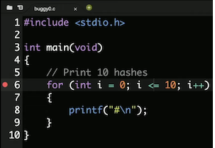
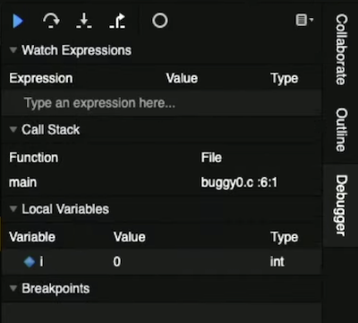
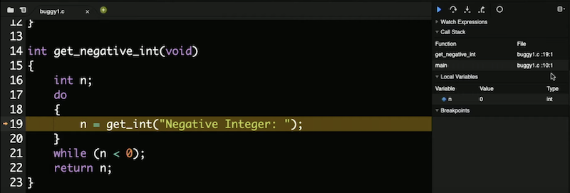
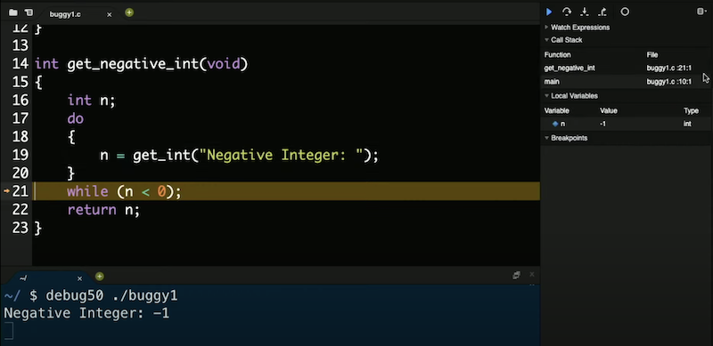
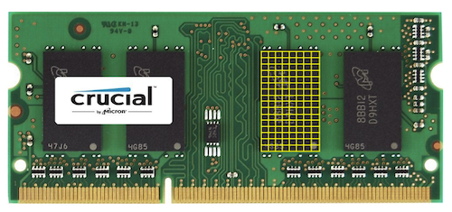
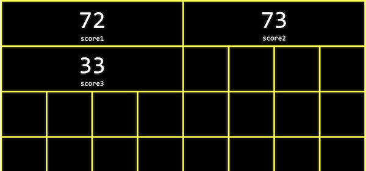
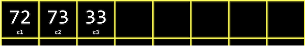
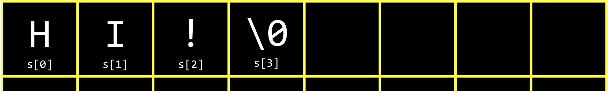
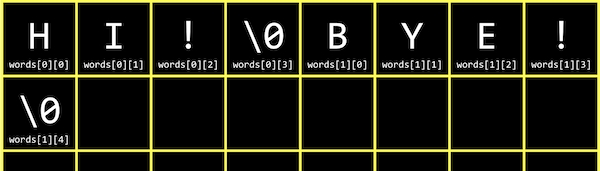

# Aula 2

- Compilando
- Debugando
- Memória
- Arrays
- Caracteres
- Strings
- Argumentos de linha de comando
- Exemplo de Aplicação

## Compilando
- Da última vez, aprendemos a escrever nosso primeiro programa em C, imprimindo “olá, mundo” na tela.
- Nós o compilamos com `make ola` primeiro, transformando nosso código-fonte em código de máquina antes de podermos executar o programa compilado com `./ola`.
- `make` é na verdade apenas um programa que chama `clang`, um compilador, com opções. Poderíamos compilar nosso arquivo de código-fonte, `ola.c`, executando o comando `clang ola.c`. Parece que nada aconteceu, o que significa que não houve erros. E se executarmos `ls`, agora vemos um arquivo `a.out` em nosso diretório. O nome do arquivo ainda é o padrão, portanto, podemos executar um comando mais específico: `clang -o ola `ola.c`.
- Nós adicionamos outro argumento de linha de comando ou uma entrada para um programa na linha de comando como palavras extras após o nome do programa. `clang` é o nome do programa e `-o`, `ola` e `ola.c` são argumentos adicionais. Estamos dizendo ao `clang` para usar `ola` como o nome do arquivo de saída e usar `ola.c` como código-fonte. Agora, podemos ver `ola` sendo criado como saída.
- Se quisermos usar a biblioteca do CS50, via `#include <cs50.h>`, para a função `get_string`, também temos que adicionar um sinalizador: `clang -o hello hello.c -lcs50`:
```c
#include <cs50.h>
#include <stdio.h>

int main(void)
{
    string nome = get_string("Qual seu nome? ");
    printf("hello, %s\n", nome);
}
```
  - O sinalizador `-l` vincula o arquivo `cs50`, que já está instalado no IDE CS50, e inclui o código de máquina para `get_string` (entre outras funções) que nosso programa pode então consultar e usar também.
- Com o `make`, esses argumentos são gerados para nós, uma vez que a equipe do CS50 também configurou o `make` no IDE CS50.
- - Compilar o código-fonte em código de máquina é, na verdade, feito de etapas menores:
  - pré-processamento
  - compilação
- montagem
  - ligação
- O **pré-processamento** geralmente envolve linhas que começam com `#`, como `#include`. Por exemplo, `#include <cs50.h>` dirá ao `clang` para procurar por esse arquivo de cabeçalho, uma vez que ele contém o conteúdo que queremos incluir em nosso programa. Então, o `clang` irá essencialmente substituir o conteúdo desses arquivos de cabeçalho em nosso programa.
- Por exemplo …
```c
#include <cs50.h>
#include <stdio.h>

int main(void)
{
    string nome = get_string("Qual seu nome? ");
    printf("hello, %s\n", nome);
}
```
- será processado como
```c
...
string get_string(string prompt);
int printf(string format, ...);
...
int main(void)
{
    string nome = get_string("Qual seu nome? ");
    printf("hello, %s\n", nome);
}
```
- Isso inclui os protótipos de todas as funções dessas bibliotecas que incluímos, para que possamos usá-las em nosso código.
- A compilação pega nosso código-fonte, em C, e o converte em outro tipo de código-fonte chamado código **assembly**, que se parece com isto:
```s
   ...
main:                         # @main
    .cfi_startproc
# BB#0:
    pushq    %rbp
.Ltmp0:
    .cfi_def_cfa_offset 16
.Ltmp1:
    .cfi_offset %rbp, -16
    movq    %rsp, %rbp
.Ltmp2:
    .cfi_def_cfa_register %rbp
    subq    $16, %rsp
    xorl    %eax, %eax
    movl    %eax, %edi
    movabsq    $.L.str, %rsi
    movb    $0, %al
    callq    get_string
    movabsq    $.L.str.1, %rdi
    movq    %rax, -8(%rbp)
    movq    -8(%rbp), %rsi
    movb    $0, %al
    callq    printf
    ...
  ```
  - Essas instruções são de baixo nível  e estão mais próximas das instruções binárias que o processador de um computador pode entender diretamente. Eles geralmente operam nos próprios bytes, em oposição a abstrações como nomes de variáveis.
- A próxima etapa é pegar o código do **assembly** e traduzi-lo em instruções em binário, **montando-o**. As instruções em binário são chamadas de **código de máquina**, que a CPU de um computador pode executar diretamente.
- A última etapa é a **linkedição**, onde versões compiladas anteriormente de bibliotecas que incluímos anteriormente, como `cs50.c`, são realmente combinadas com o binário de nosso programa. Portanto, acabamos com um arquivo binário, `a.out` ou `ola`, que é o código de máquina combinado para `ola.c`, `cs50.c` e stdio.c. (No IDE CS50, o código de máquina pré-compilado para `cs50.c` e stdio.c já foi instalado e o clang foi configurado para localizá-los e usá-los.)
- Essas quatro etapas foram abstraídas ou simplificadas pelo `make`, portanto, tudo o que precisamos implementar é o código de nossos programas.

## Debugando
- **Bugs** são erros ou problemas em programas que fazem com que eles se comportem de maneira diferente do pretendido. E a depuração é o processo de localização e correção desses bugs.
- Na semana passada, aprendemos sobre algumas ferramentas que nos ajudam a escrever código que compila, tem bom estilo e está correto:
  - **help50**
  - **style50**
  - **check50**
- Podemos usar outra “ferramenta”, a função `printf`, para imprimir mensagens e variáveis para nos ajudar a depurar.
Vamos dar uma olhada em `buggy0.c`:
```c
#include <stdio.h>

int main(void)
{
    // Exibe 10 hashs
    for (int i = 0; i <= 10; i++)
    {
        printf("#\n");
    }
}
```
  - Humm, queremos imprimir apenas 10 #s, mas há 11. Se não soubéssemos qual é o problema (já que nosso programa está compilando sem erros e agora temos um erro lógico), poderíamos adicionar outro `printf` temporariamente:
```c
#include <stdio.h>

int main(void)
{
    for (int i = 0; i <= 10; i++)
    {
        printf("%2i. \n", i);
        printf("#\n");
    }
}
```
  - Agora, podemos ver que eu comecei em `0` e continuei até chegar a `10`, mas devemos fazer nosso loop for parar quando estiver em `10`, com `i < 10` em vez de `i <= 10`.
- No IDE CS50, temos outra ferramenta, **debug50**, para nos ajudar a depurar programas. Esta é uma ferramenta escrita pela equipe que se baseia em uma ferramenta padrão chamada `gdb`. Ambos os **depuradores** são programas que executam nossos próprios programas passo a passo e nos permitem examinar as variáveis e outras informações enquanto nosso programa está em execução.
- Vamos executar o comando `debug50 ./buggy0`, e ele nos dirá para recompilar nosso programa desde que o alteramos. Em seguida, ele nos dirá para adicionar um **ponto de interrupção**, ou indicador para uma linha de código onde o depurador deve pausar nosso programa.
  - Usando as teclas para cima e para baixo no terminal, podemos reutilizar comandos do passado sem digitá-los novamente.
- Clicaremos à esquerda da linha 6 em nosso código e um círculo vermelho aparecerá:



- Agora, se executarmos `debug50 ./buggy0` novamente, veremos o painel do depurador aberto à direita:



- Vemos que a variável que criamos, `i`, está na seção Variáveis locais, e vemos que há um valor de `0`.
- Nosso ponto de interrupção pausou nosso programa na linha 6, destacando essa linha em amarelo. Para continuar, temos alguns controles no painel do depurador. O triângulo azul continuará nosso programa até chegarmos a outro ponto de interrupção ou o fim de nosso programa. A seta curva à sua direita, **Step Over**, irá “ultrapassar” a linha, executando-a e pausando nosso programa novamente imediatamente depois dela.
- Então, vamos usar a seta curva para percorrer a próxima linha e ver o que muda depois. Estamos na linha `printf` e, pressionando a seta curva novamente, vemos um único `#` impresso em nossa janela de terminal. Com outro clique na seta, vemos o valor de `i` mudar para `1`. Podemos continuar clicando na seta para ver o nosso programa rodar, uma linha de cada vez.
- Para sair do depurador, podemos pressionar **control + C** para interromper o programa em execução.
- Vejamos outro exemplo, `buggy1.c`:
```c
#include <cs50.h>
#include <stdio.h>

// Prototype
int inteiro_negativo(void);

int main(void)
{
    // Pede um inteiro negativo ao usuario
    int i = inteiro_negativo();
    printf("%i\n", i);
}

int inteiro_negativo(void)
{
    int n;
    do
    {
        n = get_int("Inteiro Negativo: ");
    }
    while (n < 0);
    return n;
}
```
  - Implementamos outra função, `inteiro_negativo`, para obter um número inteiro negativo do usuário. Precisamos lembrar o protótipo antes de nossa função principal e, em seguida, nosso código é compilado.
- Mas quando executamos nosso programa, ele continua nos pedindo um número inteiro negativo, mesmo depois de fornecermos um. Vamos definir um ponto de interrupção na linha 10, `int i = inteiro_negativo();`, já que é a primeira linha de código interessante. Executaremos `debug50 ./buggy1` e veremos na seção Pilha de chamadas do painel de depuração que estamos na função `main`. (A "pilha de chamadas" refere-se a todas as funções que foram chamadas em nosso programa no momento, e ainda não retornaram. Até agora, apenas a função `main` foi chamada.)
- Clicaremos na seta apontando para baixo, **Step Into**, e o depurador nos levará para a função chamada nessa linha, `inteiro_negativo`. Vemos a pilha de chamadas atualizada com o nome da função e a variável `n` com o valor `0`:



- Podemos clicar na seta **Step Over** novamente e ver `n` ser atualizado com `-1`, que é realmente o que inserimos:



- Clicamos em Step Over novamente e vemos nosso programa voltando para dentro do laço. Nosso laço `while` ainda está em execução, então a condição que ele verifica ainda deve ser verdadeira. E vemos que `n < 0` é verdadeiro mesmo se inserirmos um número inteiro negativo, então devemos corrigir nosso bug alterando-o para `n >= 0`.
- Podemos economizar muito tempo no futuro investindo um pouco agora para aprender como usar o `debug50`!
- Também podemos usar **ddb**, abreviação de “duck debugger”, uma técnica real em que explicamos o que estamos tentando fazer com um pato de borracha e, muitas vezes, percebemos nosso próprio erro de lógica ou implementação conforme o explicamos .

## Memória
- Em C, temos diferentes tipos de variáveis ​​que podemos usar para armazenar dados, e cada uma delas ocupa uma quantidade fixa de espaço. Na verdade, diferentes sistemas de computador variam na quantidade de espaço realmente usado para cada tipo, mas vamos trabalhar com as quantidades aqui, conforme usadas no IDE CS50:
  - bool 1 byte
  - char 1 byte
  - double 8 bytes
  - float 4 bytes
  - int 4 bytes
  - long 8 bytes
  - string ? bytes
  - …
- Dentro de nossos computadores, temos chips chamados RAM, **memória** de acesso aleatório, que armazena dados para uso de curto prazo, como o código de um programa enquanto está em execução ou um arquivo enquanto está aberto. Podemos salvar um programa ou arquivo em nosso disco rígido (ou SSD, unidade de estado sólido) para armazenamento de longo prazo, mas usamos RAM porque é muito mais rápido. No entanto, a RAM é volátil ou requer energia para manter os dados armazenados.
- Podemos pensar nos bytes armazenados na RAM como se estivessem em uma grade:



  - Na realidade, existem milhões ou bilhões de bytes por chip.
- Cada byte terá um local no chip, como o primeiro byte, o segundo byte e assim por diante.
- Em C, quando criamos uma variável do tipo `char`, que terá o tamanho de um byte, ela será armazenada fisicamente em uma dessas caixas na RAM. Um inteiro, com 4 bytes, ocupará quatro dessas caixas.

## Arrays
- Digamos que quiséssemos calcular a média de três variáveis:
```c
#include <stdio.h>

int main(void)
{
    int ponto1 = 72;
    int ponto2 = 73;
    int ponto3 = 33;

    printf("Media: %f\n", (ponto1 + ponto2 + ponto3) / 3.0);
}
```
  - Dividimos não por 3, mas por 3,0, então o resultado também é um float.
  - Podemos compilar e executar nosso programa e ver uma média impressa.
- Enquanto nosso programa está em execução, as três variáveis int são armazenadas na memória:



  - Cada `int` ocupa quatro caixas, representando quatro bytes, e cada byte por sua vez é feito de oito bits, 0s e 1s armazenados por componentes elétricos.
- Acontece que, na memória, podemos armazenar variáveis uma após a outra, consecutivamente, e acessá-las mais facilmente com laços. Em C, uma lista de valores armazenados um após o outro de forma contígua é chamada de **array**.
- Para nosso programa acima, podemos usar `int pontos[3]`; para declarar **vetor** (outro nome para array) de três inteiros.
- E podemos atribuir e usar variáveis em uma matriz com `pontos[0] = 72`. Com os colchetes, estamos indexando ou indo para a posição "0" na matriz. Vetores são **indexados** começando por zero, o que significa que o primeiro valor tem índice 0 e o segundo valor tem índice 1 e assim por diante.
- Vamos atualizar nosso programa para usar um array:
```c
#include <cs50.h>
#include <stdio.h>

int main(void)
{
    int pontos[3];
    pontos[0] = get_int("Score: ");
    pontos[1] = get_int("Score: ");
    pontos[2] = get_int("Score: ");

    // Exibe a media
    printf("Media: %f\n", (pontos[0] + pontos[1] + pontos[2]) / 3.0);
}
```
  - Agora, estamos pedindo ao usuário três valores e imprimindo a média como antes, mas usando os valores armazenados na matriz.
- Como podemos definir e acessar itens em um vetor com base em sua posição, e essa posição também pode ser o valor de alguma variável, podemos usar um laço:
```c
#include <cs50.h>
#include <stdio.h>

int main(void)
{
    int pontos[3];
    for (int i = 0; i < 3; i++)
    {
      pontos[i] = get_int("Pontos: ");
    }

    // Exibe a Media
    printf("Media: %f\n", (pontos[0] + pontos[1] + pontos[2]) / 3.0);
}
```
  - Agora, em vez de embutir no código ou especificar manualmente cada elemento três vezes, usamos um laço for ei como o índice de cada elemento no vetor.
- E repetimos o valor 3, representando o comprimento do nosso vetor, em dois lugares diferentes. Portanto, podemos usar uma constante ou variável com um valor fixo em nosso programa:
```c
#include <cs50.h>
#include <stdio.h>

const int TOTAL = 3;

int main(void)
{
    int pontos[TOTAL];
    for (int i = 0; i < TOTAL; i++)
    {
      pontos[i] = get_int("Pontos: ");
    }

    printf("Media: %f\n", (pontos[0] + pontos[1] + pontos[2]) / TOTAL);
}
```
  - Podemos usar a palavra-chave **const** para informar ao compilador que o valor de `TOTAL` nunca deve ser alterado por nosso programa. E por convenção, colocaremos nossa declaração da variável fora da função principal e colocaremos seu nome em maiúscula, o que não é necessário para o compilador, mas mostra a outros humanos que essa variável é uma constante e torna fácil ver desde o início .
  - Mas agora nossa média estará incorreta ou quebrada se não tivermos exatamente três valores.
- Vamos adicionar uma função para calcular a média:
```c
float media(int tamanho, int vetor[])
{
    int soma = 0;
    for (int i = 0; i < tamanho; i++)
    {
        soma += vetor[i];
    }
    return soma / (float) tamanho;
}
```
  - Vamos passar o comprimento e um vetor de `ints` (que pode ser de qualquer tamanho) e usar outro laço dentro de nossa função auxiliar para somar os valores em uma variável de soma. Usamos (`float`) para lançar comprimento em um `float`, então o resultado que obtemos da divisão dos dois também é um `float`.
  - Agora, em nossa função `main`, podemos chamar nossa nova função média com `printf ("Media:%f\n", media(TOTAL, pontos);`. Observe que os nomes das variáveis em `main` não precisam corresponder ao que a média os chama, já que apenas os valores são passados.
  - Precisamos passar o comprimento do vetor para a função `media`, para que ela saiba quantos valores existem.

## Caracteres
- Podemos imprimir um único caractere com um programa simples:
```c
#include <stdio.h>

int main(void)
{
    char c = '#';

    printf("%c\n", c);
}
```
  - Quando executamos este programa, obtemos `#` impresso no terminal.
- Vamos ver o que acontece se mudarmos nosso programa para imprimir `c` como um inteiro:
```c
#include <stdio.h>

int main(void)
{
    char c = '#';

    printf("%i\n", (int) c);
}
```
  - Quando executamos este programa, obtemos `35`. Acontece que `35` é de fato o código ASCII para um símbolo `#`.
  - Na verdade, não precisamos fazer cast de `c` para um `int` explicitamente; o compilador pode fazer isso por nós neste caso.
- Um `char` é um único byte, então podemos imaginá-lo como sendo armazenado em uma caixa na grade de memória acima.

## Strings
- Podemos imprimir uma `string`, ou algum texto, criando uma variável para cada caractere e imprimindo-os:
```c
#include <stdio.h>

int main(void)
{
    char c1 = 'H';
    char c2 = 'I';
    char c3 = '!';

    printf("%c%c%c\n", c1, c2, c3);
}
```
- Vamos exibir cada um dos caracteres como inteiro:
```c
#include <stdio.h>

int main(void)
{
    char c1 = 'H';
    char c2 = 'I';
    char c3 = '!';

    printf("%i %i %i\n", c1, c2, c3);
}
```
  - Veremos os valores 72, 73 e 33 exibidos e podemos perceber que estes valores estão armazenados na memória como:



- **Strings** são, na verdade, apenas vetores de caracteres e definidas não em C, mas pela biblioteca CS50. Se tivéssemos um vetor chamado `s`, cada caractere pode ser acessado com `s[0]`, `s[1]` e assim por diante.
- E acontece que uma `string` termina com um caractere especial, `'\0'`, ou um byte com todos os bits definidos como `0`. Esse caractere é chamado de caractere **nulo** ou **NUL**. Então, na verdade, precisamos de quatro bytes para armazenar nossa `string` com três caracteres:



- Podemos usar uma `string` como um vetor em nosso programa e imprimir os códigos ASCII, ou valores inteiros, de cada caractere da `string`:
```c
#include <cs50.h>
#include <stdio.h>

int main(void)
{
    string s = "HI!";
    printf("%i %i %i %i\n", s[0], s[1], s[2], s[3]);
}
```
  - E, como poderíamos esperar, vemos `72` `73` `33` e `0` impressos. 
  - Na verdade, poderíamos tentar acessar `s[4]` e ver algum símbolo inesperado impresso. Com C, nosso código tem a capacidade de acessar ou alterar a memória que de outra forma não deveria, o que é poderoso e perigoso.
- Podemos usar um loop para imprimir todos os caracteres em uma string:
```c
#include <cs50.h>
#include <stdio.h>

int main(void)
{
    string s = get_string("Entrada:  ");
    printf("Saida: ");
    for (int i = 0; s[i] != '\0'; i++)
    {
        printf("%c", s[i]);
    }
    printf("\n");
}
```
- Podemos mudar a condição do nosso laço para continuar independentemente do que `i` seja, mas apenas quando `s[i]! = '\0'`, ou quando o caractere na posição atual em `s` não for o caractere nulo.
- Podemos usar uma função que vem com a biblioteca de `strings` de C, `strlen`, para obter o comprimento da `string` para nosso laço:
```c
#include <cs50.h>
#include <stdio.h>
#include <string.h>

int main(void)
{
    string s = get_string("Entrada:  ");
    printf("Saida: ");
    for (int i = 0; i < strlen(s); i++)
    {
        printf("%c", s[i]);
    }
    printf("\n");
}
```
- Temos a oportunidade de aprimorar o projeto de nosso programa. Nosso laço foi um pouco ineficiente, pois verificamos o comprimento da `string`, após cada caractere ser impresso, em nossa condição. Mas, uma vez que o comprimento da `string` não muda, podemos verificar o comprimento da `string` uma vez:
```c
#include <cs50.h>
#include <stdio.h>
#include <string.h>

int main(void)
{
    string s = get_string("Entrada: ");
    printf("Saida:\n");
    for (int i = 0, n = strlen(s); i < n; i++)
    {
        printf("%c\n", s[i]);
    }
}
```
  - Agora, no início de nosso laço, inicializamos uma variável `i` e `n` e lembramos o comprimento de nossa `string` em `n`. Então, podemos verificar os valores sem ter que chamar `strlen` para calcular o comprimento da `string` a cada vez.
  - E precisamos usar um pouco mais de memória para armazenar `n`, mas isso nos economiza algum tempo por não termos que verificar o comprimento da `string` todas as vezes.
Podemos declarar um vetor de duas `strings`:
```c
string words[2];
words[0] = "HI!";
words[1] = "BYE!";
```
E na memória, a matriz de strings pode ser armazenada e acessada com:



  - `words[0]` refere-se ao primeiro elemento, ou valor, da matriz de palavras, que é uma `string` e, portanto, `words[0][0]` se refere ao primeiro elemento dessa `string`, que é um caractere.
  - Portanto, um `array` de strings é apenas um `array` de arrays de caracteres.
- Agora podemos combinar o que vimos, para escrever um programa que pode transformar letras em maiúsculas:
```c
#include <cs50.h>
#include <stdio.h>
#include <string.h>

int main(void)
{
    string s = get_string("Antes: ");
    printf("Depios:  ");
    for (int i = 0, n = strlen(s); i < n; i++)
    {
        if (s[i] >= 'a' && s[i] <= 'z')
        {
            printf("%c", s[i] - 32);
        }
        else
        {
            printf("%c", s[i]);
        }
    }
    printf("\n");
}
```
  - Primeiro, obtemos uma `string` `s` do usuário. Então, para cada caractere na `string`, se for minúsculo (o que significa que tem um valor entre o de `a` e `z`), nós o convertemos em maiúsculas. Caso contrário, apenas imprimimos.
  - Podemos converter uma letra minúscula em seu equivalente maiúsculo subtraindo a diferença entre seus valores ASCII. (Sabemos que as letras minúsculas têm um valor ASCII mais alto do que as letras maiúsculas e a diferença é a mesma entre as mesmas letras, portanto, podemos subtrair para obter uma letra maiúscula de uma letra minúscula.)
- Acontece que existe outra biblioteca, `ctype.h`, que podemos usar:
```c
#include <cs50.h>
#include <ctype.h>
#include <stdio.h>
#include <string.h>

int main(void)
{
    string s = get_string("Antes: ");
    printf("Depois:  ");
    for (int i = 0, n = strlen(s); i < n; i++)
    {
        if (islower(s[i]))
        {
            printf("%c", toupper(s[i]));
        }
        else
        {
            printf("%c", s[i]);
        }
    }
    printf("\n");
}
```
  - Agora, nosso código está mais legível e provavelmente correto, já que outros escreveram e testaram essas funções para nós.
- Podemos simplificar ainda mais, e apenas passar cada caractere para o `toupper`, já que ele não altera caracteres não minúsculos:
```c
#include <cs50.h>
#include <ctype.h>
#include <stdio.h>
#include <string.h>

int main(void)
{
    string s = get_string("Antes: ");
    printf("Depois:  ");
    for (int i = 0, n = strlen(s); i < n; i++)
    {
        printf("%c", toupper(s[i]));
    }
    printf("\n");
}
```
- Podemos usar as páginas de manual do CS50 para encontrar e aprender sobre as funções comuns da biblioteca. Ao pesquisar as [páginas de manual](https://man.cs50.io/), vemos que `toupper()` é uma função, entre outras, de uma biblioteca chamada `ctype`, que podemos usar.

## Argumentos de Linha de Comando
- Os nossos próprios programas também podem aceitar argumentos de linha de comando ou palavras adicionadas após o nome do nosso programa no próprio comando.
- Em `argv.c`, mudamos a aparência de nossa função `main` como abaixo:
```c
#include <cs50.h>
#include <stdio.h>

int main(int argc, string argv[])
{
    if (argc == 2)
    {
        printf("ola, %s\n", argv[1]);
    }
    else
    {
        printf("ola, mundo\n");
    }
}
```
- `argc` e `argv` são duas variáveis que nossa função `main` obterá automaticamente quando nosso programa for executado na linha de comando. `argc` é a contagem de argumentos, ou número de argumentos, e `argv`, vetor de argumentos (ou lista de argumentos), uma matriz de strings.
O primeiro argumento, `argv[0]`, é o nome do nosso programa (a primeira palavra digitada, como ./ola). Neste exemplo, verificamos se temos dois argumentos e imprimimos o segundo se houver.
- Por exemplo, se executarmos `./argv` Inacio, receberemos olá, Inacio impresso, já que digitamos Inacio como a segunda palavra em nosso comando.
- Também podemos imprimir cada caractere individualmente:
```c
#include <cs50.h>
#include <stdio.h>
#include <string.h>

int main(int argc, string argv[])
{
    if (argc == 2)
    {
        for (int i = 0, n = strlen(argv[1]); i < n; i++)
        {
            printf("%c\n", argv[1][i]);
        }
    }
}
```
  - Usaremos `argv[1][i]` para acessar cada caractere no primeiro argumento de nosso programa.
- Acontece que nossa função principal também retorna um valor inteiro. Por padrão, nossa função principal retorna `0` para indicar que nada deu errado, mas podemos escrever um programa para retornar um valor diferente:
```c
#include <cs50.h>
#include <stdio.h>

int main(int argc, string argv[])
{
    if (argc != 2)
    {
        printf("esta faltando um argumento de linha de comando\n");
        return 1;
    }
    printf("ola, %s\n", argv[1]);
    return 0;
}
```
  - O valor de retorno de `main` em nosso programa é chamado de código de saída, geralmente usado para indicar códigos de erro. (Vamos escrever o retorno `0` explicitamente no final do nosso programa aqui, mesmo que tecnicamente não seja necessário.)
- À medida que escrevemos programas mais complexos, códigos de erro como este podem nos ajudar a determinar o que deu errado, mesmo que não seja visível ou significativo para o usuário
- Você pode ver o código retornado pela função `main`, isto é, seu programa, digitando o comando
  - `echo $?`
imediatamente após executar seu programa.
  - Mas lembre-se, se você executar qualquer outro programa ou comando antes de `echo $?`, você verá o resultado do programa ou comando mais recente e não o do seu programa.

## Exemplo de Aplicação
- Agora que sabemos como trabalhar com strings em nossos programas, bem como códigos escritos por outros em bibliotecas, podemos analisar parágrafos de texto quanto ao seu nível de legibilidade, com base em fatores como o comprimento e a complexidade das palavras e frases.
- A criptografia é a arte de embaralhar ou ocultar informações. Se quisermos enviar uma mensagem a alguém, podemos criptografar ou, de alguma forma, embaralhar essa mensagem para que seja difícil para outras pessoas lerem. A mensagem original, ou entrada para nosso algoritmo, é chamada de texto simples, e a mensagem criptografada, ou saída, é chamada de texto cifrado. E o algoritmo que faz o embaralhamento é chamado de cifra. Uma cifra geralmente requer outra entrada além do texto simples. Uma chave, como um número, é alguma outra entrada mantida em segredo.
- Por exemplo, se quisermos enviar uma mensagem como ILOVEYOU, podemos primeiro convertê-la para ASCII: 73 76 79 86 69 89 79 85. Em seguida, podemos criptografá-la com uma chave de apenas 1 e um algoritmo simples, onde apenas adicione a chave a cada valor: 74 77 80 87 70 90 80 86. Então, o texto cifrado depois de converter os valores de volta para ASCII seria JMPWFZP V. Para descriptografar isso, alguém teria que saber que a chave é 1 e subtrair de cada personagem!
- Vamos aplicar esses conceitos em nossas seções e conjunto de problemas!