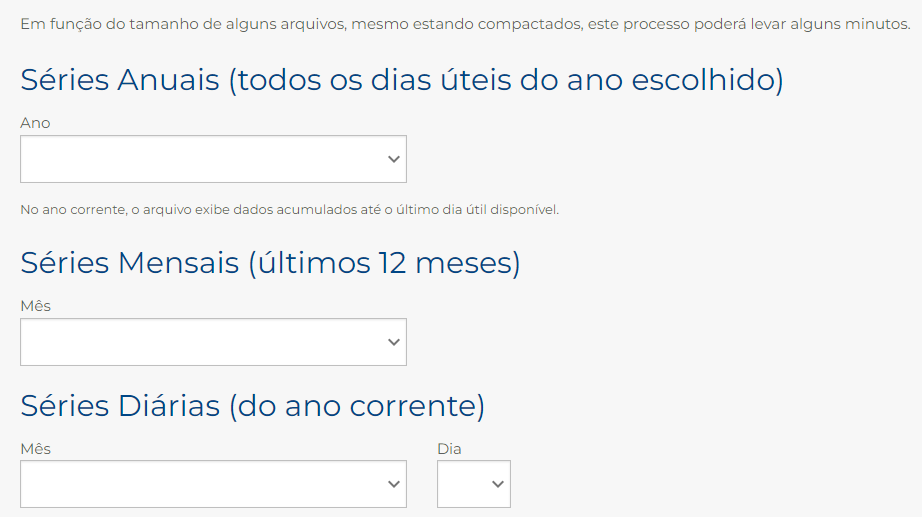

# Lendo e convertendo arquivos entre formatos

Todos os dias, a B3 (bolsa de valores brasileira) divulga um arquivo contendo a [lista de todos os instrumentos negociados](https://www.b3.com.br/pt_br/market-data-e-indices/servicos-de-dados/market-data/historico/mercado-a-vista/series-historicas/).

Você poderá baixar arquivos com séries anuais, mensais ou apenas de um dia específico do ano corrente, como pode ser visto na imagem abaixo.


Todos os arquivos são compactados em formato `ZIP`. Ao descompactar o arquivo diário, você verá que ele possui uma série de letras, números e espaço branco.

```
00COTAHIST.2022BOVESPA 20220505                                                                                                                                                                                                                      
012022050502A1AP34      010ADVANCE AUTODRN          R$  000000000634200000000063570000000006342000000000634600000000063570000000000000000000000000000003000000000000000004000000000000025385000000000000009999123100000010000000000000BRA1APBDR001110
012022050502A1BB34      010ABB LTD     DRN          R$  000000000371700000000037370000000003715000000000371700000000037150000000000000000000000585000003000000000000000055000000000000204451000000000000009999123100000010000000000000BRA1BBBDR009102
012022050522BPAN12      010BANCO PAN   BNS PRE N1   R$  000000000004400000000000450000000000040000000000004200000000000410000000000041000000000004200212000000000000433800000000000018412200000000000000009999123100000010000000000000BRBPANN01PR5100
012022050502PETR4       010PETROBRAS   PN      N2   R$  000000000318100000000032500000000003102000000000318900000000032010000000003201000000000320264928000000000099439900000000317120355500000000000000009999123100000010000000000000BRPETRACNPR6202
012022050502PETZ3       010PETZ        ON  ED  NM   R$  000000000159400000000015990000000001503000000000153300000000015170000000001517000000000151916133000000000005489000000000008417927400000000000000009999123100000010000000000000BRPETZACNOR2105
012022050502PFIZ34      010PFIZER      DRN          R$  000000000612300000000061630000000006005000000000610200000000060390000000006039000000000610000548000000000000206151000000001257991451000000000000009999123100000010000000000000BRPFIZBDR006148
012022050578BBDCF173    070BBDC    /EJ PN      N1000R$  000000000024000000000002400000000000240000000000024000000000002400000000000085000000000000000001000000000000000040000000000000009600000000000157602022061700000010000000000000BRBBDCACNPR8738
012022050578BBDCF175    070BBDC  FM/EJ ON      N1000R$  000000000002700000000000270000000000027000000000002700000000000270000000000000000000000000000006000000000000043427000000000001172529000000000158902022061700000010000000000000BRBBDCACNOR1738
012022050582CYREQ140    080CYREE       ON      NM000R$  000000000002400000000000300000000000021000000000002200000000000220000000000013000000000005000009000000000000009400000000000000215800000000000134402022052000000010000000000000BRCYREACNOR7136
012022050582CYREQ145    080CYREE  FM   ON      NM000R$  000000000003600000000000480000000000036000000000004500000000000390000000000000000000000004900015000000000000034700000000000001580800000000000139402022052000000010000000000000BRCYREACNOR7136
012022050582CYREQ150    080CYREE  FM   ON      NM000R$  000000000006200000000000660000000000060000000000006500000000000660000000000057000000000000000006000000000000011500000000000000751600000000000144402022052000000010000000000000BRCYREACNOR7136
```

Em um primeiro momento, o arquivo pode ser assustador. Mas quando conhecemos o "[protocolo](https://www.b3.com.br/data/files/33/67/B9/50/D84057102C784E47AC094EA8/SeriesHistoricas_Layout.pdf)" que define tal arquivo, passamos a entender o que cada parte significa.

São muitas as informações contidas neste arquivo e o objetivo é extrair algumas dessas informações e salvar em um arquivo com um formato (protocolo) diferente, chamado CSV (_Comma separeted values_ ou valores separados por vírgula).

Embora o nome seja "separado por vírgula", na prática, os dados dentro do arquivo podem ser separados por qualquer caractere que não faça parte dos próprios dados. Como exemplo, podemos citar os arquivos de usuários do Linux onde os dados são separados por dois-pontos, como podemos ver abaixo:
```
root:x:0:0:root:/root:/bin/bash
daemon:x:1:1:daemon:/usr/sbin:/usr/sbin/nologin
bin:x:2:2:bin:/bin:/usr/sbin/nologin
sys:x:3:3:sys:/dev:/usr/sbin/nologin
sync:x:4:65534:sync:/bin:/bin/sync
games:x:5:60:games:/usr/games:/usr/sbin/nologin
man:x:6:12:man:/var/cache/man:/usr/sbin/nologin
tcpdump:x:108:113::/nonexistent:/usr/sbin/nologin
inacio:x:1000:1000:,,,:/home/inacio:/bin/bash
```
Este também parece um arquivo assustador, porém, com menos esforço podemos entender mais rapidamente.
- A primeira coluna contém o nome do usuário
- A segunda tinha a senha, mas há muito tempo a senha foi movida para outro arquivo
- A coluna seguinte contém o identificador (número) do usuário 
- A próxima o identificador do grupo padrão do usuário
- A próxima pode conter informações extras sobre o usuário. Se tais informações não existem, o espaço entre os dois pontos fica vazio
- A seguinte contém o diretório padrão do usuário
- Por fim, o programa de terminal de comandos do usuário

# Voltando ao arquivo da B3
- No arquivo descrito acima, a primeira linha contém a "versão" do arquivo. Na prática, uma parte fixa
```
00COTAHIST.2022BOVESPA
```
e uma variável
```
20220505
```
sendo que a parte variável consiste na data do arquivo no formato `AAAAMMDD`. Ou seja, o ano com 4 dígitos, seguido do mês com 2 dígitos, por fim o dia com 2 dígitos (por que usar esse formato de data em vez do formato que conhecemos (D/M/A)?)

- Cada linha seguinte até a penúltima, consiste em dados de um dos instrumentos (como são chamados os produtos). O arquivo de o [protocolo](https://www.b3.com.br/data/files/33/67/B9/50/D84057102C784E47AC094EA8/SeriesHistoricas_Layout.pdf) traz todas as informações do significado de cada trecho de uma linha. Para os propósitos do presente trabalho, você precisará extrair as seguintes informações:

| Informação             | Colunas |
|------------------------|---------|
|Código de negociação    | 13-24   |
|Tipo de mercado         | 25-27   |
|Nome resumido da empresa| 28-39   |
|Preço de fechamento     | 109-121 |
|Quantidade negociada    | 153-170 |
|Preço de Exercício      | 189-201 |
|Data de Vencimento      | 203-210 |

O que significa cada uma dessas informações?
- **Código** de negociação é um código único atribuído a cada produto que pode ser negociado. Por exeplo:
  -  `PETR4` é o código das ações preferenciais de `Petrobras` enquanto `PETR3` também é código de negociação de `Petrobras`, mas se referem às ações ordinárias.
  - `CSNA3` é o código referente às ações da empresa `CSN Mineração`
  - `CSNAF540` é referente a opções de COMPRA de `CSN` enquanto 
  - `CSNAR440` é referente a opções de VENDA de `CSN`.
Não é necessário entender o que os produtos em si significam nem como eles funcionam, o importante é saber que cada produto possui um código único.
- O **tipo de mercado** também é definido por um código de `3` caracteres. Aqui, estaremos interessados nos códigos
  - `010`, mercado a vista (VISTA)
  - `020`, mercado fracionário (FRAC)
  - `070`, opções de compra (CALL)
  - `080`, opções de venda (PUT)
- O **nome resumido da empresa** é o nome que aparece, juntamente com o código, nas plataformas de negociação de bancos e corretoras para que os clientes possam identificar do que se trata o produto.
- O **preço de fechamento** consiste no preço do último negócio realizado no dia. É muito usado por investidores e fundos de investimentos que querem saber ao final do dia se estão ganhando ou perdendo dinheiro
- A **quantidade negociada** indica quantos produtos "trocaram" de mãos durante o dia

As duas últimas informações são exclusivas para o mercado de opções, então você perceberá que essas colunas terão valor igual a `00000000000` e `99991231`, respectivamente quando a linha não corresponder a uma opção.

## Observação
Note que as colunas referentes a preços e quantidades são preenchidas com zeros à esquerda

# Objetivo do presente trabalho
Você deverá extrair os dados listados acima e gravá-los em um novo arquivo no formato CSV, usando ponto-e-vírgula como separador.

- A primeira linha do arquivo deverá ser como abaixo:
```
Codigo;Tipo;NomeResumido;Fechamento;Quantidade;PrecoExercicio;DataVencimento
```

- As demais linhas devem ser preenchidas com valores vindos das colunas correspondentes do arquivo de texto, com as seguintes observações:
  - Para a coluna de tipo, você deverá escrever:
    - VISTA, FRAC, CALL ou PUT, de acordo com o tipo do mercado
  - As colunas de preço deverão ser salvas na forma de um número decimal, com a parte fracionária separada por vírgula em vez de ponto. O número **NÃO** deve possuir zeros à esquerda
  - A coluna de quantidade deverá ser salva como inteiro e **NÃO** deve possuir zeros à esquerda

  Deste modo, o arquivo convertido deverá se parecer com o trecho abaixo:
```
Codigo;Tipo;NomeResumido;Fechamento;Quantidade;PrecoExercicio;DataVencimento
PETR4;VISTA;PETROBRAS;32.01;9943990;0;99991231
PFIZ34;VISTA;PFIZER;206151;0;99991231
CYREQ140;PUT;CYREE;0.22;9400;13.44;20220520
BBDCF173;CALL;BBDC;2.4;40;15.76;20220617
```