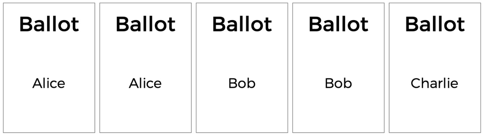
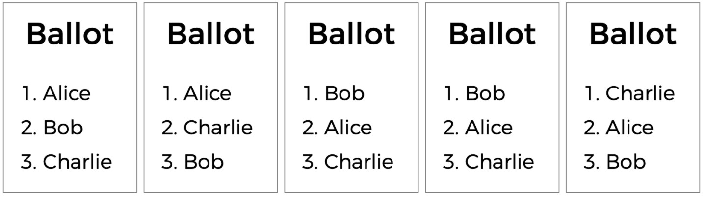
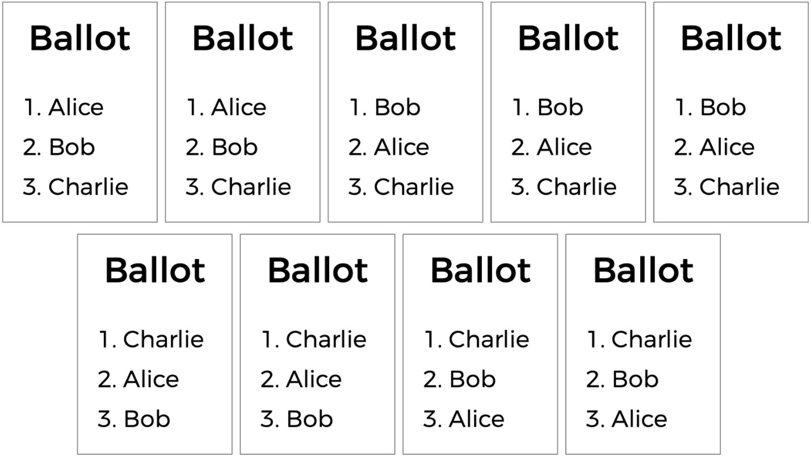
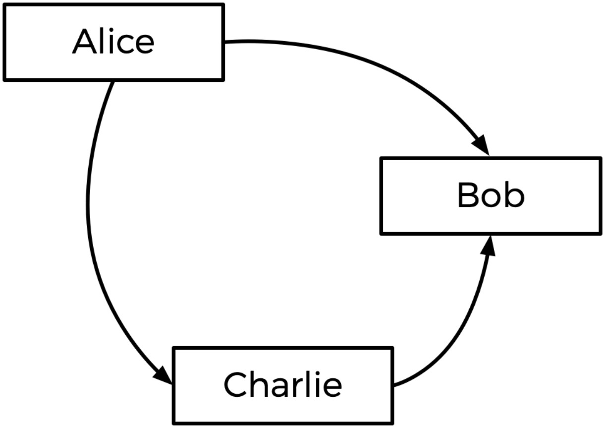

# Tideman
Implemente um programa que executa a eleição *tideman*. O resultado deve ser como no exemplo abaixo.
```
./tideman Alice Bob Charlie
Number of voters: 5
Rank 1: Alice
Rank 2: Charlie
Rank 3: Bob

Rank 1: Alice
Rank 2: Charlie
Rank 3: Bob

Rank 1: Bob
Rank 2: Charlie
Rank 3: Alice

Rank 1: Bob
Rank 2: Charlie
Rank 3: Alice

Rank 1: Charlie
Rank 2: Alice
Rank 3: Bob

Charlie
```

## Introdução
Você já conhece as eleições majoritárias (*plurality*), que seguem um algoritmo muito simples para determinar o vencedor de uma eleição: cada eleitor tem um voto e o candidato com mais votos vence.

Mas o voto plural tem algumas desvantagens. O que acontece, por exemplo, em uma eleição com três candidatos, e as cédulas abaixo são lançadas?



Uma votação de majoritária declararia aqui um empate entre Alice e Bob, já que cada um tem dois votos. Mas esse é o resultado certo?

Existe outro tipo de sistema de votação conhecido como **sistema de votação de escolha por classificação**. Em um sistema de escolha por classificação, os eleitores podem votar em mais de um candidato. Em vez de apenas votar na primeira escolha, eles podem classificar os candidatos em ordem de preferência. As cédulas resultantes podem, portanto, ter a aparência abaixo.



Aqui, cada eleitor, além de especificar seu primeiro candidato preferencial, também indicou sua segunda e terceira opções. E agora, o que antes era uma eleição empatada, pode ter um vencedor. A eleição foi originalmente empatada entre Alice e Bob, então Charlie estava fora da eleição. Mas o eleitor que escolheu Charlie preferiu Alice a Bob, então Alice poderia ser declarada vencedora.

A votação por escolha classificada também pode resolver outra desvantagem potencial da votação por pluralidade. Dê uma olhada nas seguintes cédulas.



Quem deve ganhar esta eleição? Em uma votação majoritária em que cada eleitor escolhe apenas sua primeira preferência, Charlie vence esta eleição com quatro votos, em comparação com apenas três para Bob e dois para Alice. (Observe que, se você estiver familiarizado com o sistema de votação *runoff*, Charlie vence aqui com esse sistema também). Alice, no entanto, pode argumentar razoavelmente que ela deveria ser a vencedora da eleição em vez de Charlie: afinal, dos nove eleitores, a maioria (cinco deles) preferia Alice a Charlie, então a maioria das pessoas ficaria mais feliz com Alice como o vencedor em vez de Charlie.

Alice é, nesta eleição, a chamada “vencedora Condorcet” da eleição: a pessoa que teria vencido qualquer confronto direto com outro candidato. Se a eleição tivesse sido apenas Alice e Bob, ou apenas Alice e Charlie, Alice teria vencido.

O método de votação do **Tideman** (também conhecido como "pares classificados") é um método de votação de escolha por classificação que é garantido para produzir o vencedor "preferido" da eleição, se houver.

De um modo geral, o método Tideman funciona construindo um "grafo" de candidatos, onde uma seta (ou seja, aresta) do candidato A ao candidato B indica que o candidato A vence o candidato B em um confronto direto. O grafo para a eleição acima, então, seria parecido com o abaixo.



A seta de Alice para Bob significa que mais eleitores preferem Alice a Bob (5 preferem Alice, 4 preferem Bob). Da mesma forma, as outras setas significam que mais eleitores preferem Alice a Charlie e mais eleitores preferem Charlie a Bob.

Olhando para este grafo, o método Tideman diz que o vencedor da eleição deve ser a "fonte" do grafo (ou seja, o candidato que não tem uma seta apontando para ele). Nesse caso, a fonte é Alice - Alice é a única que não tem uma seta apontando para ela, o que significa que ninguém é preferido frente a frente a Alice. Alice é, portanto, declarada a vencedora da eleição.

É possível, no entanto, que quando as flechas forem puxadas, não haja um vencedor "preferido". Considere as cédulas abaixo.


Entre Alice e Bob, Alice é preferida a Bob por uma margem de 7-2. Entre Bob e Charlie, Bob é o preferido a Charlie por uma margem de 5-4. Mas entre Charlie e Alice, Charlie é o preferido a Alice por uma margem de 6-3. Se desenharmos o grafo, não haverá fonte! Temos um ciclo de candidatos, onde Alice vence Bob que vence Charlie que vence Alice (muito parecido com um jogo de pedra-papel-tesoura). Nesse caso, parece que não há como escolher um vencedor.

Para lidar com isso, o algoritmo Tideman deve ter cuidado para evitar a criação de ciclos no grafo candidato. Como isso faz? O algoritmo bloqueia nas arestas mais fortes primeiro, uma vez que essas são, sem dúvida, as mais significativas. Em particular, o algoritmo do Tideman especifica que as bordas da partida devem ser "travadas" no grafo, uma de cada vez, com base na "força" da vitória (quanto mais pessoas preferirem um candidato ao adversário, mais forte será a vitória). Desde que a aresta possa ser travada no grafo sem criar um ciclo, a aresta é adicionada; caso contrário, a borda é ignorada.

Como isso funcionaria no caso dos votos acima? Bem, a maior margem de vitória para um par é Alice derrotando Bob, já que 7 eleitores preferem Alice a Bob (nenhuma outra disputa direta tem um vencedor preferido por mais de 7 eleitores). Portanto, a seta Alice-Bob é travada no grafo primeiro. A próxima maior margem de vitória é a vitória de Charlie por 6-3 sobre Alice, de modo que a flecha é a próxima.

A seguir vem a vitória de Bob por 5-4 sobre Charlie. Mas observe: se adicionássemos uma flecha de Bob a Charlie agora, criaríamos um ciclo! Uma vez que o grafo não permite ciclos, devemos pular esta borda e não adicioná-la ao grafo. Se houvesse mais setas a serem consideradas, olharíamos para as próximas, mas essa foi a última seta, então o grafo está completo.

Este processo passo a passo é mostrado abaixo, com o grafo final à direita.


Com base no grafo resultante, Charlie é a fonte (não há nenhuma seta apontando para Charlie), então Charlie é declarado o vencedor desta eleição.

Colocado de maneira mais formal, o método de votação do Tideman consiste em três partes:

- *Contar*: Uma vez que todos os eleitores indicaram todas as suas preferências, determine, para cada par de candidatos, quem é o candidato preferido e com que margem ele é preferido.
- *Classificar*: Classifique os pares de candidatos em ordem decrescente de força de vitória, onde a força de vitória é definida como o número de eleitores que preferem o candidato preferido.
- *Travar*: começando com o par mais forte, passe pelos pares de candidatos em ordem e “trave” cada par no grafo candidato, desde que travar nesse par não crie um ciclo no grafo.

Uma vez que o grafo esteja completo, a fonte do grafo (aquele sem arestas apontando para ele) é o vencedor!

## Começando
Veja como baixar o "código de distribuição" deste problema (ou seja, código inicial) em seu próprio CS50 IDE. Faça login no CS50 IDE e, em uma janela de terminal, execute cada um dos itens abaixo.

- Execute `cd` para garantir que você está em `~/` (ou seja, seu diretório inicial).
- Execute `cd pset3` para mudar para (ou seja, abrir) seu diretório `pset3` que já deveria existir. Caso o diretório não exista, ele pode ser criado com o comando `mkdir pset3`
- Execute `mkdir tideman` para fazer (ou seja, criar) um diretório chamado `tideman` em seu diretório `pset3`.
- Execute `cd tideman` para mudar para (ou seja, abrir) esse diretório.
- Execute `wget https://cdn.cs50.net/2019/fall/psets/3/tideman/tideman.c`
para baixar o código de distribuição deste problema.
- Execute `ls`. Você deve ver o código de distribuição deste problema, em um arquivo chamado `tideman.c`.

## Compreensão
Vamos abrir o `tideman.c` para dar uma olhada no que já está lá.

Primeiro, observe a matriz `preferences`. Cada inteiro em `preferences[i][j]` representara o número de eleitores que preferem o candidato i ao candidato j.

O arquivo também define outra matriz bidimensional, chamada `locked`, que representará o grafo de candidato. `locked` é um array booleano, portanto, `locked[i][j]` sendo verdadeiro representa a existência de uma aresta apontando do candidato i para o candidato j; falso significa que não há aresta. (Se estiver curioso, esta representação de um grafo é conhecida como uma “matriz de adjacência”).

Em seguida, vem uma `struct` chamada `pair`, usada para representar um par de candidatos: cada par inclui o índice de candidato do vencedor e o índice de candidato do perdedor.

Os próprios candidatos são armazenados na matriz `candidates`, que é uma matriz de strings que representa os nomes de cada um dos candidatos. Há também uma matriz de `pairs`, que representará todos os pares de candidatos (para os quais um é preferido em relação ao outro) na eleição.

O programa também possui duas variáveis ​​globais: `pair_count` e `candidate_count`, representando o número de pares e o número de candidatos na matriz `pairs`, respectivamente.

Agora na função `main`. Observe que, após determinar o número de candidatos, o programa percorre o grafo de bloqueado e inicialmente define todos os valores como `false`, o que significa que nosso grafo de inicial não terá arestas.

Em seguida, o programa percorre todos os eleitores e coleta suas preferências em uma matriz chamada `ranks` (por meio de uma chamada para `vote`), onde `ranks[i]` é o índice do candidato que é a i-ésima preferência pelo eleitor. Essas classificações são passadas para a função `record_preference`, cujo trabalho é pegar essas classificações e atualizar a variável global `preferences`.

Uma vez que todos os votos estão registrados, os pares de candidatos são adicionados ao array `pairs` por meio de uma chamada para `add_pairs`, classificados por meio de uma chamada para `sort_pairs` e bloqueados no grafo de por meio de uma chamada para `lock_pairs`. Finalmente, `print_winner` é chamada para imprimir o nome do vencedor da eleição!

Mais abaixo no arquivo, você verá que as funções `vote`, `record_preference`, `add_pairs`, `sort_pairs`, `lock_pairs` e `print_winner` foram deixadas deixadas em branco. Você deverá programa-las!

## Especificação
Conclua a implementação de tideman.c de forma que simule uma eleição Tideman.

- Conclua a função de `vote`.
  - A função recebe argumentos `rank`, `name` e `ranks`. Se `name` corresponder ao nome de um candidato válido, você deve atualizar a matriz `ranks` para indicar que o eleitor tem o candidato como sua preferência de classificação (onde 0 é a primeira preferência, 1 é a segunda preferência, etc.)
  - Lembre-se de que as `ranks[i]` aqui representam a i-ésima preferência do usuário.
  - A função deve retornar `true` se a classificação foi registrada com sucesso e `false` caso contrário (se, por exemplo, `name` não for o nome de um dos candidatos).
  - Você pode presumir que dois candidatos não terão o mesmo nome.
-  Conclua a função `record_preferences`.
    - A função é chamada uma vez para cada eleitor e leva como argumento a matriz `ranks` (lembre-se de que `ranks[i]` é a i-ésima preferência do eleitor, onde `ranks[0]` é a primeira preferência.
    - A função deve atualizar a matriz global `ranks` para adicionar as preferências do eleitor atual. Lembre-se de que as `preferences[i][j]` devem representar o número de eleitores que preferem o candidato i ao candidato j.
    - Você pode presumir que cada eleitor classificará cada um dos candidatos.
- Complete a função `add_pairs`.
  - A função deve adicionar todos os pares de candidatos onde um candidato é preferido à matriz de pares. Um par de candidatos empatados (um não tem preferência sobre o outro) não deve ser adicionado à matriz.
  - A função deve atualizar a variável global `pair_count` para ser o número de pares de candidatos. (Os pares devem, portanto, ser armazenados entre os pares `[0]` e os pares `[pair_count - 1]`, inclusive).
- Complete a função `sort_pairs`.
  - A função deve ordenar a matriz `pairs` em ordem decrescente de força de vitória, onde força de vitória é definida como o número de eleitores que preferem o candidato preferido. Se vários pares tiverem a mesma força de vitória, você pode assumir que a ordem não importa.
- Conclua a função `lock_pairs`.
  - A função deve criar o grafo `locked`, adicionando todas as arestas em ordem decrescente de força de vitória, desde que a aresta não crie um ciclo.
- Conclua a função `print_winner`.
  - A função deve imprimir o nome do candidato que é a fonte do grafo. Você pode presumir que não haverá mais de uma fonte.

Você não deve modificar nada mais em `tideman.c`, exceto as implementações das funções `vote`, `record_preferences`, `add_pairs`, `sort_pairs`, `lock_pairs` e `print_winner` (e a inclusão de arquivos de cabeçalho adicionais, se desejar). Você tem permissão para adicionar funções extras ao `tideman.c`, desde que não altere as declarações de nenhuma das funções existentes.

## Uso
Seu programa deveria se comportar como no exemplo abaixo:

```
./tideman Alice Bob Charlie
Number of voters: 5
Rank 1: Alice
Rank 2: Charlie
Rank 3: Bob

Rank 1: Alice
Rank 2: Charlie
Rank 3: Bob

Rank 1: Bob
Rank 2: Charlie
Rank 3: Alice

Rank 1: Bob
Rank 2: Charlie
Rank 3: Alice

Rank 1: Charlie
Rank 2: Alice
Rank 3: Bob

Charlie
```

## Testando seu código

Certifique-se de testar seu código para garantir que ele trata corretamente...

- Uma eleição com qualquer número de candidatos (até o MAX de 9)
- Votar em um candidato pelo nome
- Votos inválidos para candidatos que não estão na cédula
- Imprimir o vencedor da eleição, se houver apenas um

Execute o comando abaixo para verificar a **corretude** do seu código. Mas tente compilar e testar antes de executar o comando
```
check50 cs50/problems/2020/x/tideman
```

Execute o comando abaixo para garantir a **estilização** do código
```
style50 tideman.c
```


## Enviando seu código
Execute o comando abaixo, logando com seu **nome de usuário** do GitHub, para enviar seu código. Por questões de segurança, asteríscos serão exibidos em vez dos caracteres da sua senha
```
submit50 cs50/problems/2020/x/tideman
```