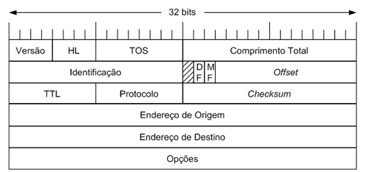

# Packet Capture - PCAP

_Packet Capture_ (ou libpcap) é uma interface de programação de aplicativos
(do inglês, _Application Programming Interface_, API) para captura de pacotes de
rede que usa a pilha de protocolos TPC/IP. Deste modo, todos os dados referentes
às camadas de
- 7. aplicação
- 4. transporte
- 3. rede
- 2. enlace

de cada uma das mensagens que passam pela(s) placa(s) de rede usada(s) na captura estarão disponíveis. 

# Objetivo
O objetivo deste exercício é abrir um arquivo de captura **pcap** e extrair algumas estatísticas sobre os dados capturados. Mais especificamente, extrair o número de ocorrência de todos os endereços IPs presentes no arquivo de captura. Uma tabela como abaixo deve ser gerada
```
IP              | Ocorrencias
192.168.0.1     | 5
200.17.33.2     | 20
172.200.232.100 | 8
...
```

# Formato de um arquivo **pcap**
De acordo com a página de documentação oficial da ferramenta _wireshark_, um arquivo **pcap** possui o seguinte formato genérico


```
|Cabeçalho global|Cabeçalho do pacote| dados do pacote|Cabeçalho do pacote| dados ...
```

## Cabeçalho global
O cabeçalho global carrega informações gerais sobre o arquivo de captura e é definido pela estrutura a seguir
```c
typedef struct pcap_hdr_s {
  guint32 magic_number;   /* numero magico */
  guint16 version_major;  /* numero de versao maior */
  guint16 version_minor;  /* numero de versao menor */
  gint32  thiszone;       /* dados GMT */
  guint32 sigfigs;        /* precisao da marca de tempo */
  guint32 snaplen;        /* tamanho max de um pacote capturado em octetos */
  guint32 network;        /* tipo de enlace */
} pcap_hdr_t;
```

## Cabeçalho de pacote
Já o cabeçalho de pacote carrega informações sobre cada um dos pacotes capturados. É definido pela estrutura abaixo:
```c
typedef struct pcaprec_hdr_s {
  guint32 ts_sec;         /* marca de tempo em segundos */
  guint32 ts_usec;        /* marca de tempo em microsegundos */
  guint32 incl_len;       /* numero de octetos, do pacote, salvos no arquivo */
  guint32 orig_len;       /* numero original de octetos do pacote */
} pcaprec_hdr_t;
```
Os dois últimos campos devem ter o mesmo valor, a menos que o usuário tenha definido filtros  durante o processo de captura, como por exemplo, capturar apenas 60 _bytes_ de cada pacote.

## Dados
Os dados de um pacote compreendem diversas estruturas concatenadas, isto é, "coladas lado a lado" que dependem dos tipos de protocolos usados. 

Em redes de computadores, o modelo tradicional usado é a pilha de protocolos TCP/IP que consiste nas quatro camadas citadas acima.

### Camada de enlace
A camada de enlace é implementada parte na placa de rede e parte no _kernel_ do sistema operacional por meio do _driver_ da placa de rede. Para este exercício, consideraremos que a captura foi feita com uma placa que usa o protocolo _Ethernet_. Neste caso, o protocolo define um cabeçalho de protocolo que armazena informações sobre os endereços **MAC** de destino e origem, `MAC Src` e `MAC Dst`, contendo 6 _bytes_ cada, bem como o tipo de protocolo usado pela camada superior ou o tamanho do quadro (campo de 2 bytes). Essas informações podem ser armazenadas em uma estrutura como abaixo:
```c
typedef struct{
  unsigned char dhost[6]; // MAC de destino
  unsigned char shost[6]; // MAC de origem
  unsigned short tipo;    // Protocolo usado pela camada de rede
}ether_hdr_t;
```

De fato, uma estrutura mais correta deveria contemplar a situação em que fosse registrado o tipo de protocolo usado pela camada de rede ou o tamanho do quadro. Uma estrutura para conter estas informações seria bem mais complicada e foge ao escopo deste exercício.

Depois dos dados do cabeçalho da camada de enlace, tem-se os dados do cabeçalho da camada de rede. A camada de rede é um tanto mais complexa que a camada de enlace e pode ser visto na imagem abaixo:


Para este trabalho, basta obter os dados dos campos `Endereço de Origem` e `Endereço de Destino`, de modo que a estrutura abaixo pode ser usada:
```c
typedef struct{
  unsigned ignore1; // Ignora os primeiros 32 bits
  unsigned ignore2; // Ignora os 32 bits seguintes
  unsigned ignore3; // Ignora os 32 bits seguintes
  unsigned ip_src;  // IP de origem
  unsigned ip_dst;  // IP de destino
}ip_hdr_t;
```

Uma estrutura mais adequada seria como abaixo:
```c
typedef struct{
  unsigned char ver:4; // 4 bits para o campo de versão
  unsigned char hl:4;  // 4 bits para o comprimento do cabeçalho
  unsigned char tos;   // Type of Service
  unsigned short len;  // Comprimento total da mensagem (IP+Transporte+Dados)
  unsigned short id;   // Identificação
  unsigned short flags:3;   // flags
  unsigned short offset:13; // offset
  unsigned char ttl; // Time to Live
  unsigned char proto; // Protocolo de Transporte
  unsigned short crc; // Checksum
  unsigned ip_src;  // IP de origem
  unsigned ip_dst;  // IP de destino
}ip_hdr_t;
```

Depois dos dados da camada de rede, podem haver informações extras da própria camada de rede, seguidas de informações da camada de transporte (que pode ser TCP ou UDP) e, por fim, informações da camada de aplicação.

Para os fins deste trabalho, o restante das informações podem ser ignoradas.

# Iniciando
1. Baixe os arquivos `wireshark.c` e `wireshark.h` indicados pelo professor.

2. Complete o arquivo `wireshark.c` de modo que o programa exija um argumento de linha de comando que deve ser o nome do arquivo `pcap` a ser aberto e lido.

3. Após garantir que o programa foi executado corretamente, isto é, com um argumento de linha de comando, tente abrir o arquivo fornecido no modo leitura binária.

4. Se o arquivo não existir, a mensagem de erro
```
uso: ./wireshark arquivo
```
deve ser informada ao usuário e o programa deve retornar o valor 1.

5. Caso o arquivo possa ser aberto

    5.1.  Leia o cabeçalho global e armazene em uma variável do tipo `pcap_hdr_t`

    5.2. Leia o cabeçalho do primeiro pacote e armazene em uma variável do tipo `pcaprec_hdr_t`.

    5.3. Leia o primeiro cabeçalho de enlace e armazend em uma variável do tipo `ether_hdr_t`.

    5.4. Leia o primeiro cabeçalho IP e armazene em uma variável do tipo `ip_hdr_t`.

    5.5. Imprima os endereços IPs de origem e destino.

Para este último item, você deve observar que:

1. O endereço IP é formado por um único número de 32 bits, mas deve ser impresso no formato padrão com quatro valores decimais (8 bits) separados por ponto.

2. Dependendo do computador onde seu programa está executando e do computador onde os dados foram capturados, poderá haver diferença na forma com que os dados são interpretados. De outro modo, o endereço IP `192.168.101.10`, "`C0.A8.65.0A`" em hexadecimal, pode estar armazenado como `C0A8650A` ou como `0A65A8C0`. Os motivos para este tipo de armazenamento fogem ao escopo da disciplina e do trabalho, mas se quiser entendê-los, pesquise sobre arquiteturas _big endian_ e _little endian_.

Mesmo que você não procure entender os motivos das formas diferentes de armazenamento, você deve tratar isto no seu programa.

# Obtendo os próximos pacotes
Adapte seu código para repetir o processo de leitura/impressão dos pacotes nos passos 5.3 a 5.5.

Observe que para passar de um pacote para o outro você deverá ler o restante dos dados (opções do IP, se houver, transporte e aplicação). Para isto, você pode usar uma variável temporária para armazenar esses dados (mas que não terá outra função ao longo do seu programa). Isto pode ser feito com um "vetor de _bytes_".

Em C, não existe o tipo _byte_, mas para os objetivos deste exercício, é suficitente criar uma variável do tipo vetor de caracteres com tamanho 1522.

# Calculando estatísticas
Agora que você já conseguiu ler e exibir cada uma das mensagens, você pode criar uma estrutura como abaixo:
```c
typedef struct{
  unsigned ip;   // Endereço IP
  unsigned contador;  // Numero de ocorrencias
}estatisticas;
```
e um vetor
```c
estatisticas ocorrencias[5000];
```
Que deve ser inicializado com valor zero nos dois campos.

Note que o tamanho do vetor `ocorrencias` limita o arquivo `pcap` a ter no máximo 5.000 endereços IPs distintos.

Outra maneira seria usar um ponteiro e alocar dinâmicamente os dados
```c
estatisticas *ocorrencias;
ocorrencias = malloc(sizeof(estatisticas) * 100);
```
e realocar o tamanho do vetor sempre que necessário.

Você ainda poderia usar uma **estrutura de dados** do tipo **lista ligada**, mas este assunto ficará para o próximo tópico.

Com o vetor de ocorrências criado, cada vez que seu programa terminar de ler um pacote ele deverá percorrer o vetor para verificar se os IPs atuais já estão presentes e:

1. Se o IP já está no vetor, o `contador` de ocorrências deve ser incrementado

2. Se o IP não existe (como você descobre isto?). Ele deve ser adicionado e o `contador` deve ser iniciado em `1`.